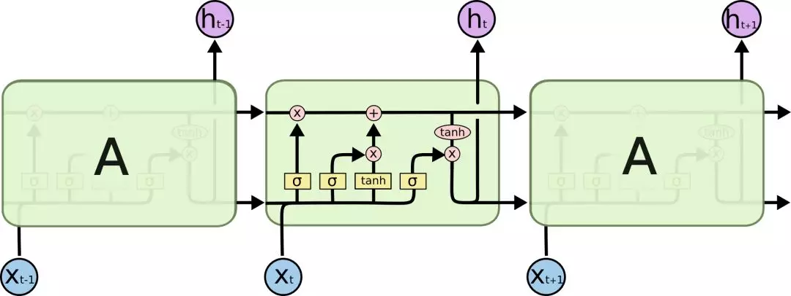
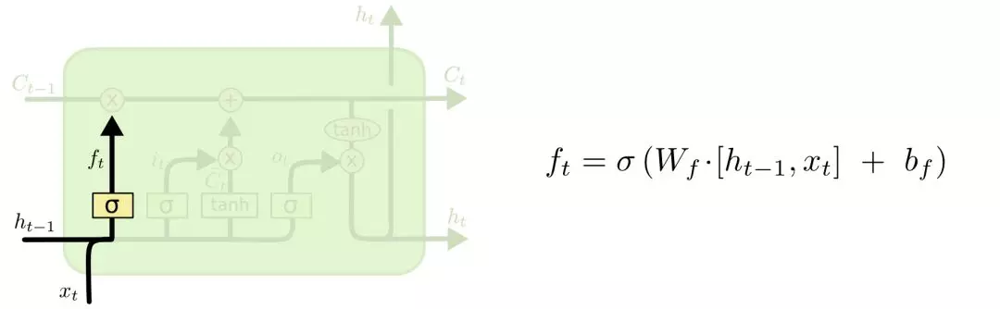
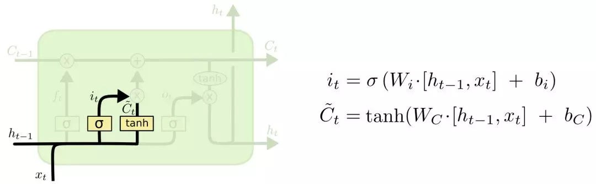
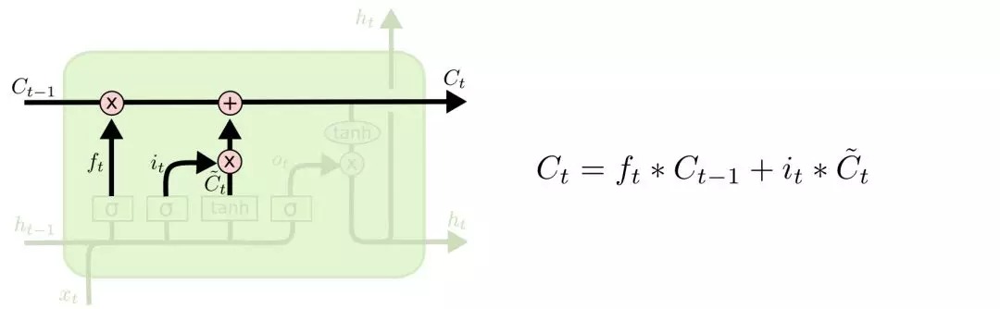
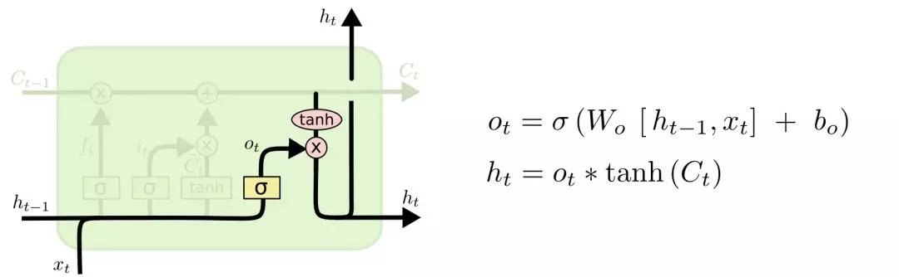
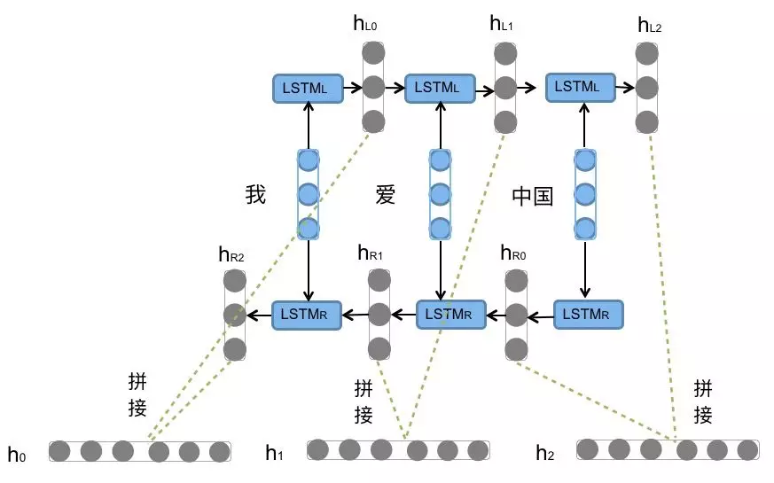

## LSTM
## 总体框架
LSTM模型是由t时刻的输入词$X_t$，细胞状态$C_t$，临时细胞状态$\widetilde{C}_t$，隐层状态$h_t$，遗忘门$f_t$，记忆门$i_t$，输出门$O_t$组成。LSTM的计算过程可以概括为，通过对细胞状态中信息遗忘和记忆新的信息使得对后续时刻计算有用的信息得以传递，而无用的信息被丢弃，并在每个时间步都会输出隐层状态$h_t$，其中遗忘，记忆与输出由通过上个时刻的隐层状态$h_{t-1}$和当前输入$X_t$计算出来的遗忘门$f_t$，记忆门$i_t$，输出门$O_t$来控制
> 总体框架如图所示

## 详细介绍计算过程
### 计算遗忘门，选择要遗忘的信息
>输入：$前一时刻的隐层状态h_{h-1}，当前时刻的输入词X_t$        
>输出：遗忘门的值$f_t$

### 计算记忆门，选择要记忆的信息。
>输入：$前一时刻的隐层状态h_{h-1}，当前时刻的输入词X_t$        
>输出：$记忆门的值i_t，临时细胞状态\widetilde{C}_t$

### 计算当前时刻细胞状态
>输入：$记忆门的值i_t，遗忘门的值f_t，临时细胞状态\widetilde{C}_t，上一刻细胞状态C_{t-1}$        
>输出：$当前时刻细胞状态C_t$

### 计算输出门和当前时刻隐层状态
>输入：$前一时刻的隐层状态h_{t-1}，当前时刻的输入词X_t ，当前时刻细胞状态C_t$        
>输出：$输出门的值O_t，隐层状态h_t$

#### $最终，我们可以得到与句子长度相同的隐层状态序列{h_0,h_1 ,h_2 ..., }$。

## BiLSTM

#### 前向的LSTM与后向的LSTM结合成BiLSTM。比如，我们对“我爱中国”这句话进行编码

 前向的依次输入“我”，“爱”，“中国”得到三个向量${h_{L0},h_{L1} ,h_{L2} }$。后向的依次输入“中国”，“爱”，“我”得到三个向量${h_{R0},h_{R1} ,h_{R2}  }$。最后将前向和后向的隐向量进行拼接得到${[h_{L0},h_{R0} ], [h_{L1},h_{R1} ], [h_{L2},h_{R2} ]}，即{h0,h1 ,h2 }$。

